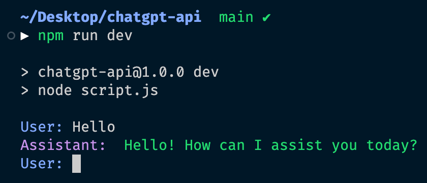

# chatGPT API

This is a terminal based chatbot that uses the OpenAI API (gpt-4 and gpt-3) to generate responses to user input

#### screenshot



## Installation

- clone the repository and `cd` into it
- run `npm install` to install the dependencies
- go to [https://platform.openai.com/account/api-keys](https://platform.openai.com/account/api-keys) and get your API key
- create a `.env` file and add your API key to it:

```bash
API_KEY=sk-xxxxxxxxxxxxxxxxxxxxxxxxxxxxxxxxxxxxxxxx
```

## Usage

- run `npm run dev` to start the chatbot
- ask the chatbot a question
- type `ctrl+c` to exit the chatbot
